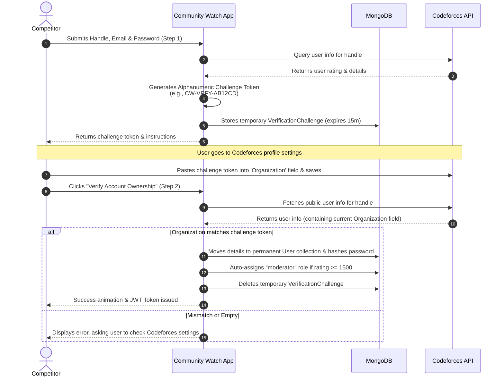

# 🛡️ CF Community Watch

**Clinical & Objective Moderation for Competitive Programming.**

[](https://react.dev/)
[](https://www.typescriptlang.org/)
[](https://vite.dev/)
[](https://tailwindcss.com/)
[](https://nodejs.org/)
[](https://expressjs.com/)
[](https://www.mongodb.com/)
[](https://cloudinary.com/)
[](https://jestjs.io/)
[](https://jwt.io/)

Community Watch is a transparent, peer-driven integrity platform designed to ensure fairness in competitive programming contests. It allows community members to report rules violations (such as plagiarism, outside assistance, or impersonation) with objective evidence. Claims are then reviewed by verified, high-rated competitive programming moderators, bringing clinical transparency to online contest integrity.

---

## 🔗 Live Links

* **Frontend Client (Vercel)**: [https://community-watch-hazel.vercel.app](https://community-watch-hazel.vercel.app)
* **Backend API (Render)**: [https://community-watch-xo5c.onrender.com/api](https://community-watch-xo5c.onrender.com/api)

---

## 📋 Table of Contents
1. [✨ Key Features](#-key-features)
2. [🛠️ Technology Stack](#️-technology-stack)
3. [🔐 Two-Step Codeforces Authentication Flow](#-two-step-codeforces-authentication-flow)
4. [📂 Project Structure](#-project-structure)
5. [🚀 Installation & Setup](#-installation-&-setup)
6. [📡 API Endpoints Reference](#-api-endpoints-reference)
7. [🛡️ Moderation Policy](#️-moderation-policy)
8. [🧪 Testing Suite](#-testing-suite)
9. [👥 Contributors](#-contributors)
10. [💖 Made with Love By](#-made-with-love-by)

---

## ✨ Key Features

* **Peer Reporting System**: Submit detailed misconduct reports with contest/problem IDs, reasons (e.g. code similarity, impersonation), and descriptions.
* **Evidence Management**: Secure, cloud-based evidence screenshot hosting using **Cloudinary**.
* **Automatic Rating Eligibility Checks**: Users are queried against the Codeforces API. Verified active members with a rating of **1500+ (Expert or higher)** are automatically granted **Moderator** privileges.
* **Clinical Moderation Board**: Moderators can review, add comments, and approve or reject active reports.
* **Public Cheater Database**: A transparent, paginated record of verified cheating incidents, including suspect handles, problem IDs, and direct evidence.
* **Real-time Search**: Quick search through the database by handles or contests.
* **Secure Cryptographic Auth**: Two-step validation preventing account impersonation on Codeforces, followed by secure JWT-based stateless sessions.

---

## 🛠️ Technology Stack

### Frontend (Client)
* **Framework**: React 19 & Vite 8
* **Language**: TypeScript
* **Routing**: React Router v7
* **Styling**: Tailwind CSS v4 (for structure/layout) & Premium Vanilla CSS (for design tokens, glassmorphism, animations, and custom theme parameters)

### Backend (Server)
* **Runtime**: Node.js (configured as ES Modules)
* **Framework**: Express.js
* **Database**: MongoDB & Mongoose ODM
* **Image Uploads**: Multer (multipart handling) & Cloudinary SDK
* **Security & Auth**: JSON Web Tokens (JWT), BcryptJS, Express Validator, and Helmet headers

---

## 🔐 Two-Step Codeforces Authentication Flow

To prevent users from signing up under handles that do not belong to them, CF Community Watch implements an interactive **two-step cryptographic handle verification**:



1. **Step 1: Initiate Challenge**: The user inputs their Codeforces handle, email, and password. The server checks the Codeforces API to confirm the handle exists, generates a secure token prefix `CW-VRFY-[RANDOM_SUFFIX]`, and saves it inside `VerificationChallenge` collection in the database.
2. **Profile Update**: The user copies this token, visits their [Codeforces Social Settings](https://codeforces.com/settings/social), pastes the token into the **Organization** field, and saves changes.
3. **Step 2: Validation**: The user clicks verify. The server queries the Codeforces API, fetches their public profile, and extracts the `organization` field. If it matches, registration is completed, role privileges are evaluated (User vs Moderator), and a JWT is issued. The token can then be safely cleared from Codeforces.

---

## 📂 Project Structure

```text
community-watch/
├── client/                     # React Frontend (Vite)
│   ├── src/
│   │   ├── components/         # Interactive UI Components
│   │   │   ├── ActiveReports.tsx # Report list and action modals
│   │   │   ├── Authform.tsx      # Sign in & Two-Step Sign up wizard
│   │   │   ├── CheaterDB.tsx     # Public cheater database view
│   │   │   ├── Footer.tsx        # Responsive navigation footer
│   │   │   ├── HomePage.tsx      # Landing page & search console
│   │   │   ├── Navbar.tsx        # Header & theme controllers
│   │   │   ├── Report.tsx        # File a report wizard
│   │   │   └── VerifyHandle.tsx  # Handle helper hooks
│   │   ├── context/            # AuthContext (JWT & state persist)
│   │   ├── api.ts              # API Client configurations
│   │   ├── index.css           # Semantic design tokens & core layout styles
│   │   ├── App.tsx             # Route management
│   │   └── main.tsx            # Main renderer
│   ├── public/                 # Static assets (logos, icons)
│   ├── tsconfig.json           # TS configuration
│   └── vite.config.ts          # Vite build options
├── server/                     # Express Backend
│   ├── src/
│   │   ├── controllers/        # Request handlers (auth, reports, reviews, users)
│   │   ├── middleware/         # Auth protector, file uploading, and validators
│   │   ├── models/             # Mongoose schemas (User, Report, Review, Challenge)
│   │   ├── routes/             # API Router definitions
│   │   └── index.js            # Server entry point
│   ├── seed-test-data.js       # Database seeding script for local testing
│   ├── jest.config.mjs         # Jest test environment settings
│   ├── test-api.sh             # Manual API test execution script
│   └── package.json
└── README.md
```

---

## 🚀 Installation & Setup

### Prerequisites
* **Node.js** (v18 or higher recommended)
* **MongoDB** (Local instance or MongoDB Atlas cluster)
* **Cloudinary** account (for evidence screenshot storage)

---

### 1. Clone the Repository
```bash
git clone https://github.com/assaampuhel/community-watch.git
cd community-watch
```

---

### 2. Setup Backend Server
1. Navigate into the `server` directory:
   ```bash
   cd server
   npm install
   ```
2. Create a `.env` file in the `server/` root and populate the following keys:
   ```env
   PORT=3000
   MONGODB_URI=mongodb://localhost:27017/community_watch
   JWT_SECRET=your_super_secret_jwt_signature_key
   CLOUDINARY_CLOUD_NAME=your_cloudinary_cloud_name
   CLOUDINARY_API_KEY=your_cloudinary_api_key
   CLOUDINARY_API_SECRET=your_cloudinary_api_secret
   ```

---

### 3. Setup Frontend Client
1. Open a new terminal and navigate to the `client` directory:
   ```bash
   cd client
   npm install
   ```
2. Create a `.env` file in the `client/` root:
   ```env
   VITE_API_URL=http://localhost:3000/api
   ```

---

### 4. Seed Database (Optional but Recommended)
To run automated/manual tests or experience the dashboard with active reports, seed the database:
```bash
cd server
mongosh < seed-test-data.js
```
This creates sample reports and three profiles: `testuser` (regular user), `moduser` (moderator), and `adminuser` (administrator).

---

### 5. Run Locally
* **Start Backend Server**: `cd server && npm run dev`
* **Start Frontend Client**: `cd client && npm run dev`
* The application runs locally at `http://localhost:5173`.

---

## 📡 API Endpoints Reference

All endpoints (except signup, login, reports search, and public cheater DB) require a JWT Bearer token in the request header:
`Authorization: Bearer <JWT_TOKEN>`

### 🔑 Authentication (`/api/auth`)

| Endpoint | Method | Description | Auth Required |
| :--- | :--- | :--- | :--- |
| `/signup-challenge` | `POST` | Check handle validity and return verification token. | No |
| `/signup-verify` | `POST` | Inspect CF Organization field. If valid, register user. | No |
| `/login` | `POST` | Authenticate user using handle/password, return JWT. | No |
| `/logout` | `POST` | Clear backend session/logs if applicable. | Yes (Protected) |

### 📋 Reports (`/api/reports`)

| Endpoint | Method | Description | Role Required |
| :--- | :--- | :--- | :--- |
| `/` | `POST` | Submit cheating report with evidence image (Multipart). | Yes (User) |
| `/` | `GET` | List active reports. Supports `status`, `contestId`, and `problemId` filters. | No (Public) |
| `/:reportId` | `GET` | Retrieve details for a specific report. | No (Public) |
| `/:reportId/status`| `PATCH`| Update report status (`pending`, `reviewed`, `resolved`). | Yes (Moderator+) |
| `/:reportId` | `DELETE`| Remove a report permanently. | Yes (Admin Only) |

### 👁️ Reviews & Moderation (`/api/reviews`)

| Endpoint | Method | Description | Role Required |
| :--- | :--- | :--- | :--- |
| `/` | `POST` | Create a review on a report (decision: `approve`/`reject`). | Yes (Moderator+) |
| `/report/:reportId` | `GET` | Fetch all reviews associated with a single report. | Yes (User) |
| `/:reviewId` | `GET` | Fetch review details. | Yes (User) |
| `/:reviewId` | `PUT` | Edit a moderator's review comment. | Yes (Moderator+) |

### 👤 User Profiles (`/api/users`)

| Endpoint | Method | Description | Role Required |
| :--- | :--- | :--- | :--- |
| `/:handle` | `GET` | Fetch profile details, CF rating, role, and avatar. | No (Public) |
| `/:handle` | `PUT` | Edit profile statistics. | Yes (Owner) |
| `/` | `GET` | Get a list of all registered members. | Yes (Admin Only) |

---

## 🛡️ Moderation Policy

CF Community Watch maintains a strict, objective, and unbiased approach to competitive programming integrity:
* **The Rating Barrier**: Only accounts with a verified Codeforces rating of **1500+ (Expert)** can participate in the moderation review board. This ensures that submitted source code, screenshots, and submission timestamps are judged by experienced programmers capable of finding plagiarized components.
* **Evidence-Centric**: Anonymous or hearsay accusations are automatically discarded. Every active listing requires a concrete link, problem reference, or uploaded image highlighting cheating behaviour.
* **Consensus-Driven**: Approving/rejecting a report requires high-grade moderator reviews to reach a critical threshold, preventing targeted harassment.

---

## 🧪 Testing Suite

### Automated Testing (Jest & Supertest)
The application includes a comprehensive test suite covering API functionality, status checking, validation middleware, role checks, and JWT authentication:
```bash
cd server
npm test
```
*Tests require a running local MongoDB. Jest will spin up a clean database environment, evaluate the endpoints, and disconnect.*

### Manual Shell Script Testing
For quick diagnostic testing of route behaviors, use the custom `test-api.sh` script located in the `server` folder:
```bash
cd server
chmod +x test-api.sh
./test-api.sh
```

---

## 👥 Contributors

This platform exists thanks to the dedicated development team behind its design, implementation, and maintenance:

| Contributor | GitHub Profile | Role & Contributions |
| :--- | :--- | :--- |
| 🛡️ **Asaph Samuel** | [@assaampuhel](https://github.com/assaampuhel) | **Full-Stack Core Developer**<br/>• Conceived core architecture & structure<br/>• Developed two-step Codeforces Cryptographic identity verification<br/>• Built context providers, app routes, and state managers |
| 🚀 **Shourya Sharma** | [@shouryasharma22](https://github.com/shouryasharma22) | **Core Backend & UI Developer**<br/>• Built server API controllers, routing & Mongoose database models<br/>• Crafted premium design styling, glassmorphic UI cards & responsiveness<br/>• Implemented evidence uploads & report review engine |

---

## 💖 Made with Love By

We are dedicated to supporting fair play and clean competition within the global coding community! 

* [](https://github.com/assaampuhel)
* [](https://github.com/shouryasharma22)

---
*Maintained by the CF Community Watch Team.*
